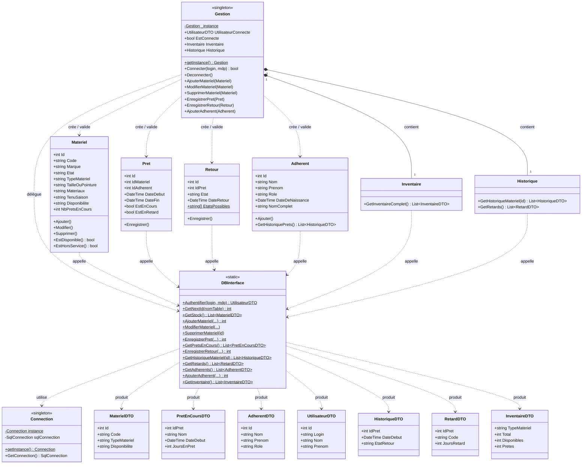
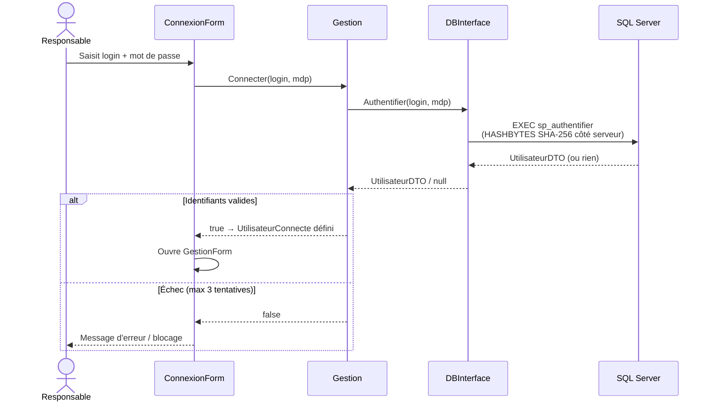
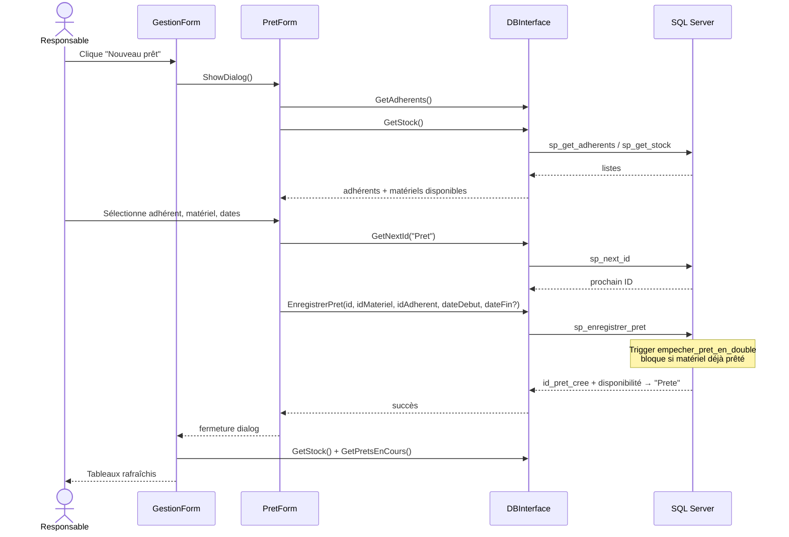
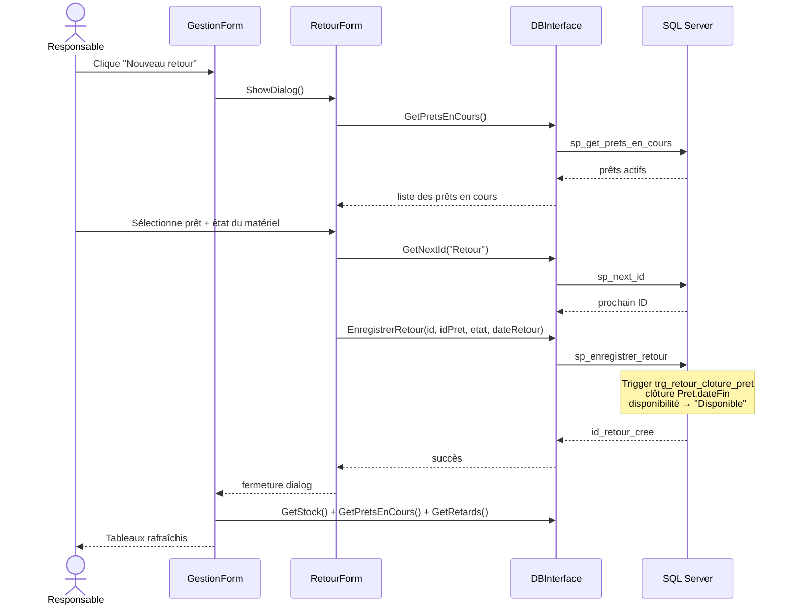

# LyonPalme — Gestion du matériel

Application desktop Windows Forms (.NET Framework 4.8) pour la gestion des équipements du club de plongée Lyon Palme. Elle permet au responsable matériel de gérer le stock, les prêts, les retours et d'identifier les retards.

---

## Prérequis

- Windows (exécution) / Visual Studio 2019+ ou MSBuild (compilation)
- .NET Framework 4.8
- Accès réseau au serveur SQL Server `192.168.100.236` (base `LPMateriel`)

---

## Configuration

Renseigner les identifiants de base de données dans `App.config` :

```xml
<add name="sqlserver_LPMateriel"
     connectionString="Data Source=192.168.100.236;Initial Catalog=LPMateriel;User ID=<login>;Password=<mdp>"
     providerName="System.Data.SqlClient" />
```

---

## Compilation & lancement

**Visual Studio** : ouvrir `client_lourd_lyonpalme.sln`, puis `Ctrl+F5`.

**MSBuild** :
```
msbuild client_lourd_lyonpalme.sln /p:Configuration=Release
bin\Release\client_lourd_lyonpalme.exe
```

Les logs d'erreurs sont écrits dans `<répertoire exe>\Logs\logerror.txt`.

---

## Fonctionnalités

| Fonctionnalité | Description |
|---|---|
| Connexion sécurisée | Authentification (3 tentatives max) ; hachage SHA-256 côté SQL Server |
| Tableau de bord | Stock, prêts en cours, retards et KPIs en un coup d'œil |
| Gestion du stock | Ajout, modification, suppression de matériel (monopalme, tuba, combinaison, lunette) |
| Prêts | Enregistrement d'un prêt avec date de fin prévue optionnelle |
| Retours | Clôture d'un prêt avec état du matériel au retour |
| Inventaire | Vue agrégée par type et taille/pointure (total / disponibles / prêtés) |
| Alertes retards | Détection des prêts dépassant 30 jours ou leur date de fin prévue |

---

## Architecture

```
Program.cs
└── Forms/ConnexionForm          ← point d'entrée UI
    └── Forms/GestionForm        ← tableau de bord principal
        ├── Forms/MaterielAddForm
        ├── Forms/MaterielEditForm
        ├── Forms/MaterielDetailsForm
        ├── Forms/PretForm
        ├── Forms/RetourForm
        ├── Forms/InventaireForm
        └── Forms/AlertForm

Models/Gestion (singleton)       ← coordinateur métier unique
├── Models/Materiel
├── Models/Pret / Retour / Adherent
├── Models/Inventaire
└── Models/Historique

DataAccess/DBInterface (static)  ← toutes les requêtes SQL (procédures stockées)
DataAccess/Connection (singleton)← SqlConnection partagée
Tools/Log                        ← journalisation fichier
```

Toutes les interactions entre les Forms et la base de données passent par `Gestion.getInstance()` → `DBInterface` → procédures stockées. Il n'y a aucun SQL inline dans le code client.

---

## Diagramme de classes



---

## Diagrammes de séquence

### 1 — Authentification



### 2 — Enregistrement d'un prêt



### 3 — Enregistrement d'un retour


